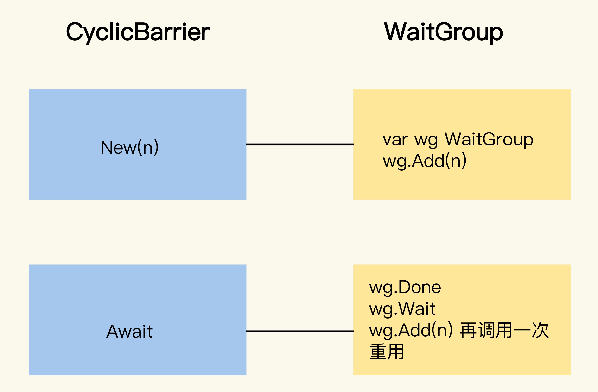

## go_cyclicbarrier

CyclicBarrier允许一组 goroutine 彼此等待，到达一个共同的执行点。同时，因为它可以被重复使用，所以叫循环栅栏。具体的机制是，大家都在栅栏前等待，等全部都到齐了，就抬起栅栏放行。

事实上，这个 CyclicBarrier 是参考[Java CyclicBarrier](https://docs.oracle.com/en/java/javase/15/docs/api/java.base/java/util/concurrent/CyclicBarrier.html)和C# Barrier的功能实现的。Java 提供了 CountDownLatch（倒计时器）和 CyclicBarrier（循环栅栏）两个类似的用于保证多线程到达同一个执行点的类，只不过前者是到达 0 的时候放行，后者是到达某个指定的数的时候放行



如果使用 WaitGroup 实现的话，调用比较复杂，不像 CyclicBarrier 那么清爽。更重要的是，如果想重用 WaitGroup，你还要保证，将 WaitGroup 的计数值重置到 n 的时候不会出现并发问题。

WaitGroup 更适合用在“一个 goroutine 等待一组 goroutine 到达同一个执行点”的场景中，或者是不需要重用的场景中。

### 初始化

1. 第一个是 New 方法，它只需要一个参数，来指定循环栅栏参与者的数量；
2. 第二个方法是 NewWithAction，它额外提供一个函数，可以在每一次到达执行点的时候执行一次。具体的时间点是在最后一个参与者到达之后，但是其它的参与者还未被放行之前。我们可以利用它，做放行之前的一些共享状态的更新等操作。

```go
func New(parties int) CyclicBarrier
func NewWithAction(parties int, barrierAction func() error) CyclicBarrier
```


